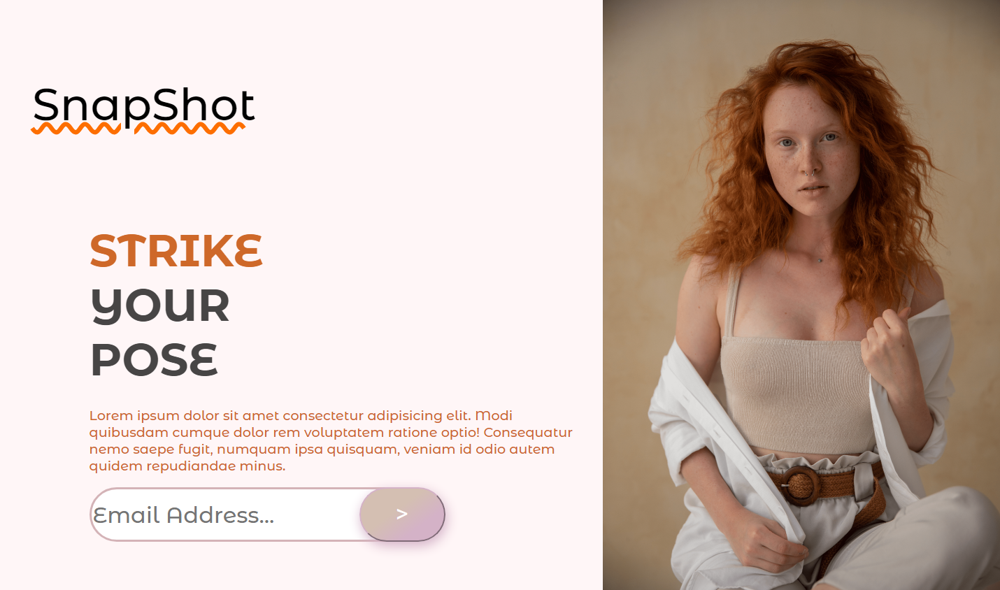
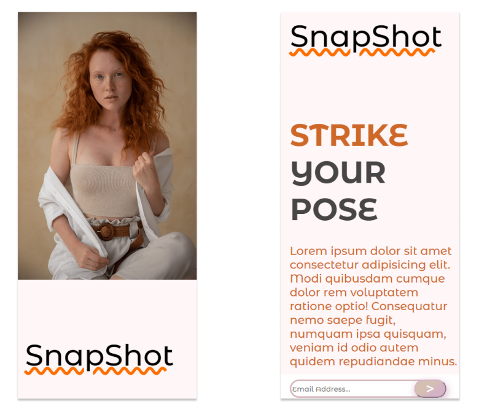

# [SnapShot-Modelling](https://kgothatson.github.io/SnapShot-Modelling/)

# Objective
To create a modelling agencies front page. This mini project was to see what I have learned so far, the overall objective was to create the entire page without looking up tutorials or documentation, though searching for the right answer is a valuable skill, relying on it soley is pointless.

# Challenges
The main challenge was making the site responsive, with mobile view being the biggest concern.

# Accomplishment
The responsiveness of the site is something I am impressed with. The site transitions between the major resolutions, 375 (Medium Phone/Iphone X), 768 (Tablet), 1024 (Laptop), 1440 (Monitors/Large Laptops) seemlessly.

# Mobile View

